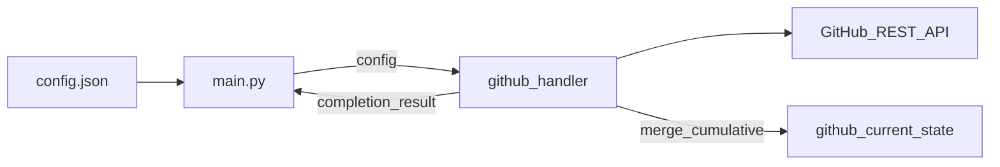
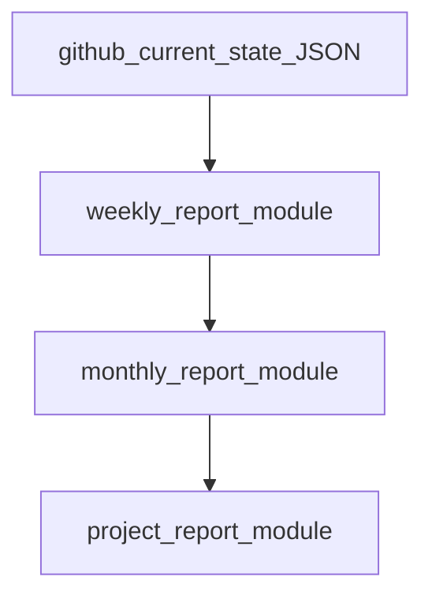

# github_repo_report – design (living document)

This document evolves incrementally. Last substantive update: context window size via `num_ctx` in config (Ollama-native); not `max_tokens` / not `num_predict`.

## Goals

- **Platforms:** Windows, Linux, macOS share one codebase; per-machine setup is limited to **paths and URLs in** `config.json` (plus optional keys such as working directories), not separate scripts per OS.
- **End-to-end:** Fetch and **retain** GitHub history in local JSON snapshots (Phase 1), then generate **weekly**, **monthly**, and **overall project** reports (Phases 2–4) using AI, prompts, and templates aligned with the proven [BITS chatbot report skill](file:///home/alex/.hermes/skills/productivity/bits-chatbot-report/SKILL.md) workflow—adapted and optimized for this repo.
- **Deliverables when implementing (all phases):** documented Python modules, populated [`templates/`](templates/) and [`prompts/`](prompts/), updated [`README.md`](README.md), and this plan kept in sync.

## Phase overview

| Phase | Module(s) | Purpose |
|-------|-----------|---------|
| **1** | `modules/github_handler` (+ optional `github_handler_helper`) | GitHub API ingestion, cumulative per-repo JSON under `github_current_state` |
| **2** | `modules/weekly_report` (+ `_helper`) | Weekly Markdown reports from cache + AI |
| **3** | `modules/monthly_report` (+ `_helper`) | Monthly reports from completed weekly files + AI |
| **4** | `modules/project_report` (+ `_helper`) | Overall project documentation (holistic rewrite from monthlies + cache) |

[`main.py`](main.py) loads config, orchestrates phases (flags or subcommands TBD), injects config into each module constructor, maps completion results to exit codes.

## Phase 1 code layout (`main.py` + `modules/github_handler`)

- **Placement:** `modules/github_handler` (package or single module; stable import e.g. `from modules.github_handler import …`).
- **Configuration contract:** `main.py` loads [`config.json`](config.json) and passes the parsed object into the handler **constructor**. The handler does not read config from disk by default (tests may inject dicts directly).
- **Autonomous lifecycle:** One high-level method (e.g. `sync_current_state`) validates config, resolves snapshot directory, refreshes each repo’s JSON, returns a **completion report** to `main.py`.
- **Helpers:** Same `modules/` folder, basename `{modulename}_helper` (e.g. `github_handler_helper.py`).

### `paths.github_current_state` resolution

1. If **`paths.github_current_state` is missing** from config → use **`github_current_state/`** relative to the **project root** (directory name exactly `github_current_state`).
2. If **set but not usable** (path does not exist and cannot be created, or not writable) → fall back to the same default: create **`{project_root}/github_current_state/`** if needed and use it.
3. If **set and valid** → resolve (absolute or relative to project root), create the directory if missing, then use it.
4. Log which path was chosen (configured vs default) for operator clarity.

### Per-repo snapshot files

- One JSON per `github_repos` entry under the resolved directory.
- Basename: `safe_filename(github_repos_entry + "_state") + ".json"` (see Configuration).

### Cumulative cache semantics (commits, issues, branches)

**Principle:** The snapshot is a **growing archive**, not a throwaway “latest only” dump. On each run the handler **loads existing JSON** (if present), **fetches from GitHub**, **merges**, and writes back. Nothing already stored is dropped unless explicitly superseded by a newer record for the same entity (same commit SHA, same issue number, same branch name).

| Domain | Retention | Update on run |
|--------|-----------|----------------|
| **Commit messages** | **All commits from the first ever seen through the latest** on the default branch (paginate until API empty on initial fill; thereafter fetch new pages / commits since last known tip SHA or date). Store SHA, author, date (UTC), full message (subject + body). | Append new SHAs; refresh metadata if GitHub amends (rare). |
| **Issues** | Full issue records keyed by **issue number**; track **state** over time (`open` / `closed`) and **when first seen** vs **when closed**. For reporting, derive per period: **new** (created in window), **open** (still open at end of window or currently open), **closed** (closed in window or currently closed). | List/search Issues API; merge by number; update `state`, `closed_at`, `updated_at`; preserve history of state changes in JSON if useful (min: latest state + `first_seen_at`). |
| **Branches** | Branch records keyed by **branch name**; track **new** (first appearance), **open** (still exists on remote), **closed** (merged into default and/or deleted on remote). | Branches API + compare/default as needed; merge by name; do not delete historical branch entries—mark `status: closed` and timestamps. |
| **Project remark** | Latest content of `paths.project_remark_and_log_file_name` plus optional `fetched_at` / not-found marker. | Replace text on each successful fetch. |

**Incremental fetch:** Prefer “since last sync” (last commit SHA, `updated` filters on issues) to limit API calls; **always merge into the cumulative store**, never truncate commit history on refresh.

**Suggested top-level JSON shape (per repo, illustrative):**

```json
{
  "repo_url": "https://github.com/...",
  "owner": "...",
  "name": "...",
  "sync": { "first_sync_at": "...", "last_sync_at": "...", "last_commit_sha": "..." },
  "commits": [ { "sha": "...", "date": "...", "author": "...", "message": "..." } ],
  "issues": [ { "number": 1, "state": "open|closed", "created_at": "...", "closed_at": null, "title": "...", "labels": [] } ],
  "branches": [ { "name": "...", "status": "open|closed", "first_seen_at": "...", "closed_at": null } ],
  "project_remark": { "found": true, "content": "...", "fetched_at": "..." }
}
```

## Branch / issue semantics for reports

Aligned with Phase 1 cache fields (report modules consume JSON, not live API):

| Entity | **new** | **open** | **closed** |
|--------|---------|----------|------------|
| **Issues** | Created in the report window (week/month). | Open at window end (or still open now for “current” views). | Closed during the window (or cumulative closed count). |
| **Branches** | First seen on remote during the window. | Still exists / not merged-deleted. | Merged into default and/or deleted on remote during or before window. |

**Commits:** All messages in the window come from the cumulative `commits` array filtered by UTC date (ISO week for weekly, calendar month for monthly).

## Configuration (`config.json`)

- `github_repos`, `paths.project_remark_and_log_file_name`, `paths.github_current_state` (optional; see fallback above).
- `paths.weekly_report`, `paths.monthly_report`, `paths.project_report` — output roots for generated Markdown.
- `prompts_and_templates` — prompt + template pairs per report type.
- `ai:config` — model, OpenRouter (or compatible) settings for Phases 2–4 (**no `response_format`**; reports are Markdown).

**Snapshot file naming:** `safe_filename(github_repos_entry + "_state") + ".json"`; filesystem-safe encoding for URL characters.

Optional later: `paths.github_token_file`, `paths.clone_root` (local git supplement).

**AI config (decided):**

- Per-model entries under `ai:config.ai_model_config` must **not** include `response_format` or `response_format_comment`. The shared AI client (Phases 2–4) must **never** add `response_format` to chat completion requests—model output is **Markdown** only.
- Use **`num_ctx`** for **context window size** (Ollama-native). Do **not** use `max_tokens` or `num_predict` in config for this purpose—`max_tokens` is OpenAI output-limit naming; `num_predict` is Ollama output-limit naming, not context size.
- In code:
  - **Ollama** (`/api/chat`, `/api/generate`): pass `num_ctx` from config in the request options.
  - **OpenAI-compatible** (OpenRouter, etc.): there is usually **no** request field for context window; use `num_ctx` **client-side** only (truncate or chunk prompts, log warnings if input exceeds budget). Do **not** map `num_ctx` to `max_tokens`.
- **Output length** (how much the model may generate): not configured in v1 unless a separate key is added later (e.g. optional `num_predict`); omit `max_tokens` from config and from OpenRouter requests unless explicitly added later.

## Data flow (Phase 1)



## Phases 2–4 — report generation (separate modules)

Reference workflow and section structure: [BITS chatbot report SKILL](file:///home/alex/.hermes/skills/productivity/bits-chatbot-report/SKILL.md) (`bits-chatbot-report`). **Analyze and optimize** for `github_repo_report`: same report *types* and Markdown *sections*, but driven by **local JSON cache** + `config.json` paths, not ad-hoc Hermes leader scripts.

### Shared rules (from skill, adapted)

- Output: **English Markdown**.
- **Weekly:** only if at least one commit in that ISO week (UTC); file naming e.g. `week_YYYY-WNN.md` under `paths.weekly_report`.
- **Monthly:** only if the month is complete and at least one weekly exists for that month; e.g. `month_YYYY-MM.md` under `paths.monthly_report`.
- **Do not overwrite** existing weekly/monthly files once written (skip if present)—unless config later adds `force_regenerate`.
- **Overall project doc:** after each monthly (and optionally incremental notes after weekly), **holistic rewrite** of the project report using the overall template (not append-only fragments).

### Phase 2 — `modules/weekly_report`

- Input: cumulative cache JSON, `prompts_and_templates.weekly_report`, `ai:config`.
- Logic: determine undocumented ISO weeks; filter commits/issues/branches for each week; call AI with prompt + template; write Markdown to `paths.weekly_report`.
- Sections (target template): Summary, Commits table, Technical Work, Challenges & Problems, Open Issues, Notes (include issue/branch summary)—derived from skill weekly template, refined in [`templates/weekly_report.txt`](templates/weekly_report.txt).

### Phase 3 — `modules/monthly_report`

- Input: weekly Markdown files for completed month, monthly prompt/template, AI config.
- Logic: aggregate weeklies; AI evaluation (successes/failures, cumulative progress); write `month_YYYY-MM.md`.

### Phase 4 — `modules/project_report`

- Input: all monthly reports + cache highlights, project prompt/template.
- Logic: holistic project documentation (Abstract, Introduction, Timeline, Architecture, Challenges log, Results, Discussion, Conclusion, Appendix)—from skill overall template, optimized in [`templates/project_report.txt`](templates/project_report.txt).

Each report module: **constructor(config)**, **run/completion API**, optional **`{name}_helper`**, returns structured result to `main.py`.



## Templates and prompts

**Status:** Final text is in the [appendix](#appendix-templates-and-prompts-file-contents) below (adapted from [BITS chatbot report SKILL](file:///home/alex/.hermes/skills/productivity/bits-chatbot-report/SKILL.md)). Improvements vs skill:

- Placeholders `{{...}}` for repo name, dates, and issue/branch counts (filled by report modules).
- Weekly/monthly sections for **GitHub issues and branches** (new / open / closed) aligned with Phase 1 cache.
- Prompts define inputs, rules, and quality bar; modules inject cache JSON + template body.

**On implement:** copy each appendix block into the matching file under [`templates/`](templates/) and [`prompts/`](prompts/) (paths already in `config.json` → `prompts_and_templates`).

## Appendix: templates and prompts (file contents)

### `templates/weekly_report.txt`

```markdown
# Weekly Report — {{REPO_DISPLAY_NAME}} — Week {{ISO_WEEK}}, {{YEAR}} ({{WEEK_START_DATE}} to {{WEEK_END_DATE}})

## Summary
<!-- 2–4 sentences: overall focus this week (features, fixes, docs, refactors). Ground in commit messages and project_remark if provided. -->

## Commits
| Date (UTC) | Author | Message |
|------------|--------|---------|
<!-- One row per commit in the ISO week. Use subject line; add body in Technical Work when relevant. -->

## GitHub Activity

### Issues
| Category | Count | Notes |
|----------|------:|-------|
| New (created this week) | {{ISSUES_NEW_COUNT}} | <!-- Notable titles or numbers --> |
| Open (still open at week end) | {{ISSUES_OPEN_COUNT}} | |
| Closed (closed this week) | {{ISSUES_CLOSED_COUNT}} | |

### Branches
| Category | Count | Notes |
|----------|------:|-------|
| New (first seen this week) | {{BRANCHES_NEW_COUNT}} | |
| Open (active at week end) | {{BRANCHES_OPEN_COUNT}} | |
| Closed (merged/deleted this week) | {{BRANCHES_CLOSED_COUNT}} | |

## Technical Work
### {{TOPIC_OR_COMPONENT}}
<!-- Group related commits. Name files, modules, APIs, or configs when inferable from messages. One subsection per major theme. -->

## Challenges & Problems
### {{PROBLEM_TITLE}}
**Description:** <!-- What went wrong or was hard? -->
**Context:** <!-- Commits, issues, or dates involved. -->
**Solution:** <!-- Resolved, workaround, or still open. -->

## Open Issues
<!-- Unresolved GitHub issues, TODO/FIXME/HACK in commits this week, and carry-over from project_remark. -->

## Notes
<!-- Dependencies (MCP, DB, APIs), metrics, project_remark highlights, or external factors. -->
```

### `templates/monthly_report.txt`

```markdown
# Monthly Report — {{REPO_DISPLAY_NAME}} — {{MONTH_NAME}} {{YEAR}}

## Overview
<!-- High-level evaluation of the month: main themes, clear successes and failures. Synthesize weekly reports; do not invent facts. -->

## Weekly Breakdown
### Week {{ISO_WEEK}} — {{WEEK_THEME}}
<!-- 2–3 sentences per week that has a weekly report in this month. -->

## Cumulative Technical Progress
<!-- End-of-month vs start-of-month: what was built, refactored, fixed, or documented. Use commits and weekly Technical Work sections. -->

## GitHub Trends (month)

### Issues
- **New:** {{ISSUES_NEW_MONTH}}
- **Closed:** {{ISSUES_CLOSED_MONTH}}
- **Open at month end:** {{ISSUES_OPEN_MONTH_END}}

### Branches
- **New:** {{BRANCHES_NEW_MONTH}}
- **Closed:** {{BRANCHES_CLOSED_MONTH}}
- **Open at month end:** {{BRANCHES_OPEN_MONTH_END}}

## Recurring Challenges
<!-- Problems that appeared in more than one week or persisted across the month. -->

## Solutions & Resolutions
<!-- Fixes and decisions implemented this month, including closure of issues from prior weeks. -->

## Unresolved Issues Carried Forward
<!-- Open GitHub issues, open branches, and TODOs moving into the next month. -->

## Metrics
| Metric | Value |
|--------|------:|
| Commits (month) | {{COMMIT_COUNT_MONTH}} |
| Weekly reports used | {{WEEKLY_REPORT_COUNT}} |
<!-- Add lines changed / files touched only if provided in source data. -->
```

### `templates/project_report.txt`

```markdown
# Project Documentation — {{REPO_DISPLAY_NAME}}

**Repository:** {{REPO_URL}}  
**Last updated:** {{REPORT_GENERATED_AT}} (UTC)

## Abstract
<!-- One paragraph: purpose, users, and primary outcome. -->

## Introduction
<!-- Background, motivation, stakeholders, research or product context. -->

## Project Timeline
<!-- Narrative from first commit in cache through present. Reference months/weeks where monthly or weekly reports exist. -->

## Technical Architecture
<!-- Components, stacks, integrations, deployment. Evolve from commits, branches, and cumulative technical progress in monthlies. -->

## Development Activity Summary
| Area | Summary |
|------|---------|
| Commits (total in cache) | {{COMMITS_TOTAL}} |
| Issues (open / closed) | {{ISSUES_OPEN_TOTAL}} / {{ISSUES_CLOSED_TOTAL}} |
| Branches (open / closed) | {{BRANCHES_OPEN_TOTAL}} / {{BRANCHES_CLOSED_TOTAL}} |

## Challenges & Problem-Solving Log
### {{CHALLENGE_TITLE}}
**First observed:** {{FIRST_SEEN_WEEK_OR_MONTH}}  
**Status:** {{OPEN_OR_RESOLVED}}  
**Description:**  
**Resolution:**  

## Results & Outcomes
<!-- Delivered capabilities, milestones, qualitative and quantitative results. -->

## Discussion
<!-- Interpretation, limitations, risks, and learnings. -->

## Conclusion
<!-- Current status and near-term outlook. -->

## Appendix
<!-- Links, glossary, related repos from config, project_remark excerpts if relevant. -->
```

### `prompts/weekly_report.txt`

```text
You are a technical project reporter for github_repo_report.

## Task
Produce a **weekly** Markdown report for one repository and one **ISO calendar week (UTC)**.

## Inputs (provided in the user message)
- Repository URL and display name
- ISO week label (e.g. 2026-W20), week start/end dates (UTC)
- Filtered **commits** for that week (sha, date, author, message)
- **Issues** buckets for the week: new (created), open (at week end), closed (closed in week)
- **Branches** buckets: new, open (at week end), closed (merged/deleted in week)
- Optional **project_remark** text from the repo root file
- The **weekly report template** (fill every section; remove HTML comments after writing)

## Rules
1. Output **English** Markdown only. No preamble outside the report.
2. Follow the template structure and headings exactly. Replace `{{PLACEHOLDER}}` tokens with real values.
3. Base claims on supplied data only. If data is missing, state “Not available” briefly—do not fabricate commits or issues.
4. **Summary:** 2–4 sentences; infer themes from conventional commit prefixes (feat, fix, docs, refactor, chore) when present.
5. **Commits table:** every commit in the week, UTC dates, one row each.
6. **Technical Work:** group by component/topic; mention files or areas when messages imply them.
7. **Challenges & Problems:** prioritize commits/issues with fix, bug, error, problem, issue; note resolved vs open.
8. **Open Issues:** GitHub issues still open at week end + TODO/FIXME/HACK/TBD in commit messages this week.
9. **Notes:** include issue/branch counts, dependencies (MCP, API, DB, CSV), and relevant project_remark lines.
10. Do not reference internal tooling (OpenRouter, this prompt, or “AI”) in the report body.

## Quality
Be specific and concise. Prefer facts from messages and issue titles over generic filler.
```

### `prompts/monthly_report.txt`

```text
You are a technical project reporter for github_repo_report.

## Task
Produce a **monthly** Markdown report for one repository and one **completed calendar month (UTC)**.

## Inputs (provided in the user message)
- Repository URL and display name
- Month label (e.g. March 2026, YYYY-MM)
- Full text of **weekly reports** for that month (may be zero or more)
- Aggregated **issue** and **branch** counts for the month (new, closed, open at month end)
- Optional **commit count** for the month from the cumulative cache
- The **monthly report template** (fill every section; remove HTML comments after writing)

## Rules
1. Output **English** Markdown only. No preamble outside the report.
2. Follow the template structure and headings exactly. Replace `{{PLACEHOLDER}}` tokens with real values.
3. **Overview:** evaluate the month honestly—call out **successes** and **failures** with concrete examples from weeklies.
4. **Weekly Breakdown:** one subsection per ISO week that has a weekly report; 2–3 sentences each; add a short theme title.
5. If a week in the month has no weekly report, omit it or note “No weekly report filed” only if the user message lists that gap.
6. **Cumulative Technical Progress:** compare start vs end of month using weekly Technical Work and commit themes.
7. **Recurring Challenges:** only patterns that appear in more than one weekly report or persist all month.
8. **Unresolved Issues Carried Forward:** merge open issues from the last weekly report and month-end cache counts.
9. Do not invent metrics; use provided counts. If lines changed are unknown, omit or say “Not tracked.”
10. Do not reference internal tooling in the report body.

## Quality
Synthesize across weeks; avoid repeating the same sentence in every weekly subsection. Keep an executive-readable tone.
```

### `prompts/project_report.txt`

```text
You are a technical project reporter for github_repo_report.

## Task
Produce or **holistically rewrite** the **overall project documentation** for one repository, incorporating the full history available in the system.

## Inputs (provided in the user message)
- Repository URL and display name
- Cumulative cache summary: commit range (first–last), issue/branch totals, optional project_remark
- All **monthly reports** to date (and optionally recent **weekly** highlights)
- The **project report template** (fill every section; remove HTML comments after writing)

## Rules
1. Output **English** Markdown only. No preamble outside the document.
2. Follow the template structure and headings exactly. Replace `{{PLACEHOLDER}}` tokens with real values.
3. This is a **full-document synthesis**, not an append-only changelog. Rewrite sections so the doc reads as one coherent narrative.
4. **Timeline** and **Architecture** must reflect the latest known state while honoring earlier milestones from monthlies.
5. **Challenges & Problem-Solving Log:** use recurring themes from monthlies/weeklies; each entry needs first observed, status, description, resolution.
6. **Results & Outcomes** and **Conclusion:** align with the most recent monthly report and current open/closed issue counts.
7. Use only supplied facts. If the cache is sparse, state limitations in **Discussion** rather than inventing history.
8. Do not reference internal tooling in the report body.

## Quality
Write for a reader who has not seen weekly/monthly files: self-contained, professional, suitable for project handover or publication draft.
```

## Cross-cutting

- **Phase 1:** HTTPS + optional GitHub token; no git binary required for baseline.
- **Phases 2–4:** OpenRouter-compatible API per `ai:config`; debug responses optional under `ai_debug/`.
- **Resilience:** per-repo and per-report-file failures isolated; partial success reflected in completion objects.
- **Code documentation:** module docstrings, public API on façade classes, brief schema comment in handler or README.

## Implementation readiness (pre-flight)

**Verdict:** Design is **sufficient to start Phase 1**; resolve the **open decisions** below before or during the first coding pass. Phases 2–4 depend on Phase 1 cache + copied templates/prompts.

### Ready (documented)

| Area | Status |
|------|--------|
| Phase goals & module boundaries | Clear (`github_handler`, `weekly_report`, `monthly_report`, `project_report`) |
| Config keys | Present in `config.json` |
| Cache semantics | Commits/issues/branches cumulative merge defined |
| `github_current_state` fallback | Defined |
| Snapshot naming | `safe_filename(url + "_state").json` (algorithm TBD) |
| Report rules | UTC ISO weeks, skip existing files, holistic project doc |
| Templates & prompts | **Complete text in appendix** (see below) |
| Helper naming | `{modulename}_helper` in `modules/` |
| AI / OpenRouter | `ai:config` + `api_keys/` (gitignored) |

### Not ready (must do at start of implement)

| Item | Current state | Action |
|------|----------------|--------|
| `templates/*.txt`, `prompts/*.txt` | **Empty on disk** | Copy from [appendix](#appendix-templates-and-prompts-file-contents) |
| `modules/` | **Missing** | Create package + Phase 1 handler |
| `main.py` | **Empty** | Load config, CLI, wire modules |
| `requirements.txt` or `pyproject.toml` | **Missing** | Pin Python ≥3.10; HTTP client if not stdlib-only |
| `modules/__init__.py` | **Missing** | Enable `from modules...` imports |

### Open decisions (pick before/during implement)

1. **`safe_filename` algorithm** — Recommend: SHA-256 prefix (8 chars) + slug `owner_repo` for readability, store `repo_url` inside JSON; or reversible percent-encoding of full URL. Document in `github_handler_helper`.
2. **Path resolution** — Treat `paths.*` values starting with `/` as **relative to project root** (strip leading `/` after join), not filesystem root. Apply to `weekly_report`, `monthly_report`, `project_report`, `github_current_state`.
3. **Multi-repo reports** — Recommend: **per-repo subdirectories** under each output path, e.g. `weekly_report/wolodkin_de_nbi/week_2026-W20.md`, so two entries in `github_repos` do not collide.
4. **Completion object** — Standard shape for all modules, e.g. `{ "ok": bool, "repos": [{ "url", "ok", "error?", "artifacts": [] }], "errors": [] }`; `main` exits `0` only if all required steps ok (or document partial-success exit code `1`).
5. **`paths.github_token_file`** — Add to config (e.g. `api_keys/github.txt`) for private org repos and rate limits; optional for public-only smoke tests.
6. **AI output format** — **No `response_format` in config or code.** Report phases (2–4) request **plain Markdown** from OpenRouter `/chat/completions` (default message content only). Do not send `response_format` in API payloads.
7. **Branch “closed” detection** — Phase 1 minimum: branch missing from Branches API → `closed` + `closed_at`; optional later: compare API against default branch.
8. **CLI surface** — Recommend: `python main.py sync` \| `weekly` \| `monthly` \| `project` \| `all`; optional `--repo-index` / `--repo-url` for single repo.
9. **`.gitignore`** — Add `github_current_state/`, `weekly_report/`, `monthly_report/`, `project_report/` (or only if under project tree) so snapshots and generated reports are not committed by mistake.

### Phase-by-phase minimum deliverable

| Phase | Done when |
|-------|-----------|
| **1** | Running `sync` writes/updates `*_state.json` per `github_repos` entry; merge preserves full commit history; log shows resolved state directory |
| **2** | At least one `week_YYYY-WNN.md` per repo with commits in that week; skips existing file |
| **3** | `month_YYYY-MM.md` for a completed month with weeklies present |
| **4** | Single holistic `project` Markdown per repo (filename TBD, e.g. `project_documentation.md` in `paths.project_report`) |
| **Docs** | README: install, config, CLI, token files; docstrings on public module APIs |

### Optional (defer)

- `force_regenerate` in config  
- `clone_root` / local git  
- Automated tests (smoke script acceptable for v1)  
- JSON schema version field in snapshot files (`schema_version: 1`)

## Implementation checklist (when leaving design)

**Phase 1**

1. `modules/github_handler` + helper; path fallback for `github_current_state`; cumulative merge logic.
2. Document JSON schema in README + docstrings.
3. Wire `main.py` (e.g. `sync` subcommand).

**Phases 2–4**

4. `modules/weekly_report`, `monthly_report`, `project_report` (+ helpers).
5. Copy appendix templates/prompts into `templates/` and `prompts/` (if not already on disk).
6. `main.py` orchestration for report phases.
7. Update README (usage, config table, phase commands, requirements).

**Housekeeping**

8. In `config.json`: rename output/context misuse `max_tokens` → **`num_ctx`** (context window only); remove `response_format` keys; fix `prompts_and_templates` comment typos.
9. Smoke-test on repos in `github_repos`.

## Optional: local git path

`clone_root` + `git fetch` may supplement branch/merge detection later; not required for API-first Phase 1.

---

*For further design changes, extend this file or bump the “Last substantive update” line at the top.*
