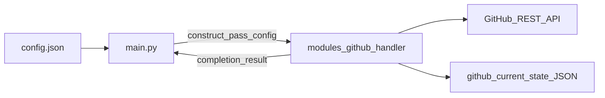

# github_repo_report – design (living document)

This document evolves incrementally. Last substantive update: helper naming—`modules/{name}_helper` alongside primary module.

## Goals

- **Platforms:** Windows, Linux, macOS share one codebase; per-machine setup is limited to **paths and URLs in** `config.json` (plus optional keys such as working directories), not separate scripts per OS.
- **Phase 1 (data layer, GitHub-only baseline):** All remote work goes through **GitHub HTTP APIs** (no local clone required for the default path). On each run, refresh structured data for every URL in `github_repos`, **persist one JSON snapshot file per repository** under **`paths.github_current_state`**, and overwrite (or optionally version) that file so the latest run is always available for downstream phases. An optional **local git mirror** remains a later extension.
- **Later phases** (out of scope for the first implementation): analytics / reports using AI and templates (`prompts_and_templates` in `config.json`).

## Phase 1 code layout (`main.py` + `modules/github_handler`)

- **Placement:** Implement GitHub orchestration as **`modules/github_handler`** (a Python package or a single module file under [`modules/`](modules/)—choose one style and keep imports stable, e.g. `from modules.github_handler import …`).
- **Configuration contract:** [`main.py`](main.py) loads [`config.json`](config.json) (path resolved the usual way). It passes the parsed configuration object into the handler’s **constructor** (e.g. a `dict` or a small typed settings object). The handler **does not** read the filesystem for config on its own unless you deliberately add that for testing; the norm is **inject via constructor** for clarity and testability.
- **Autonomous lifecycle (expected):** After construction, a single high-level method (name TBD, e.g. `run`, `sync_current_state`) performs: validate required keys, resolve `paths.github_current_state`, iterate `github_repos`, call the GitHub API layer, write per-repo JSON, aggregate per-repo success/failure. It returns a **completion report** (structured result object) to `main.py`, which decides **process exit code** and user-visible logging.
- **Reusability:** The handler exposes a **narrow public API** (constructor + one or two methods). Small, shared utilities may live in the **same `modules/` folder** under the companion name **`{modulename}_helper`** (see below); keep the façade thin and import only what the handler needs.

**Helper file naming (project-wide convention):** When a primary module under [`modules/`](modules/) needs extracted helpers, place them in the **same directory** as that feature’s entrypoint, using the basename **`{modulename}_helper`**. Examples for Phase 1: `modules/github_handler.py` may import from **`modules/github_handler_helper.py`**; if the primary unit is a package `modules/github_handler/`, still add **`modules/github_handler_helper.py`** as a **sibling** next to the package folder (same parent `modules/`), unless a future rule explicitly moves helpers inside the package. Use the same pattern for other features: `modules/foo.py` ↔ `modules/foo_helper.py`.

### Module vs loose “helpers” (design choice)

| Approach | When it fits |
|----------|----------------|
| **Dedicated module + façade class** | Cohesive I/O (HTTP + disk), injected config, you want **tests without** going through `main`, and a **clear boundary** for future reuse (another entrypoint, job runner, or notebook). **Recommended here.** |
| **Flat helper functions only** | Tiny, stateless transforms with no orchestration. Phase 1 still needs orchestration (loop repos, pagination, atomic writes), so a **class or module-level façade** avoids a scattered “script in disguise.” |

**If reuse never materializes:** a single well-bounded module is still valuable for **readability and tests**; optional **`_helper`** siblings avoid bloating the façade file. Revisit further extraction when a second importer appears or when combined size becomes unwieldy.

## Branch semantics (“open”, “closed”, “active”)

**Decided:** Metrics refer to **plain Git branches** (as exposed by GitHub: default branch + branch list / compare semantics), **not** Pull Requests as the definition of “branch”.

Suggested mapping for reporting (tunable at implementation time):

| Term | Meaning (Git-oriented) |
|------|-------------------------|
| **active** | Branch exists on the remote and is “live” for reporting (e.g. tip not yet integrated into the default branch—finalize the exact rule in Phase 1). |
| **closed** | Branch is **merged** into the default branch and/or **deleted** on the remote (infer via API compare / branch existence, or via local `git` if that mode is enabled). |
| **open** | Synonym or sub-case of **active**: branch exists and merge into default is still pending—if three separate counters are required, document the rule explicitly (e.g. only count `refs/heads/*` from the API branch list). |

**Issues:** GitHub **REST API** (`open` / `closed`). A **GitHub token** (path in `config.json` or environment variable) supports private repos and higher rate limits—configuration only, no OS-specific code.

**Commit messages:** Prefer **GitHub Commits API** (paginated) into the per-repo JSON; optional **`git log`** only if a local clone mode is implemented.

## Configuration (`config.json`)

Already present, among others:

- `github_repos`: list of clone URLs (each entry is the logical key for its snapshot file name).
- `paths.github_current_state`: directory (relative to the project root or absolute—user-adjustable per machine) where **current repo snapshots** are stored: **one JSON file per entry** in `github_repos`.
- `paths.project_remark_and_log_file_name`: filename (e.g. `project_remark.txt`) relative to **repo root**; fetch via **Contents API** (or equivalent) and store the text (or a not-found marker) in that repo’s JSON snapshot.

**Snapshot file naming:** basename = **the exact `github_repos` string** + `_state`, with a **`.json`** extension for clarity. Characters such as `/`, `:`, and `?` are not valid in file names on every OS; the implementation maps each URL string to a **stable, reversible or at least injective safe filename** (e.g. percent-encoding, slug with underscores, or a short hash with a sidecar mapping—pick one approach and document it in code comments). The on-disk name must remain **uniquely tied to that `github_repos` entry**.

**Still optional in config (when needed):**

- `paths.github_token_file` or `github.token_file` for authenticated API access.
- `paths.clone_root` only if you enable a **local git** ingestion path alongside or instead of API-only.

All configured paths are **normalized** at runtime (e.g. `pathlib`) so mixed separators work on Windows.

## Data flow (Phase 1, API-first)

1. `main.py` loads `config.json` and constructs **`modules.github_handler`** with that config.
2. For each `github_repos` URL, parse **`owner` / `repo`** (support `https://github.com/...` and `git@github.com:...`).
3. Handler calls GitHub REST endpoints (with pagination where required) for **commits**, **branches**, **issues**, and **repository contents** for `project_remark_and_log_file_name`.
4. Handler merges responses into a single **structured object** per repo (schema fixed at implementation), add run metadata (`fetched_at`, API `ETag` / `SHA` where useful).
5. Handler atomically writes one file per repo under the resolved **`paths.github_current_state`** directory, using **`safe_filename(github_repos_entry + "_state") + ".json"`** (see Configuration for `safe_filename`).
6. Handler returns a **completion object** to `main.py` (aggregate OK / per-repo errors); `main.py` maps that to logging and process exit code.

**Trade-offs (API-only):** subject to **rate limits**; private repos need a **token**; very large histories need careful pagination. **Merged-vs-open branch** detection may require extra compare calls—acceptable for Phase 1 if bounded (e.g. only default branch vs listed branches).

## Optional: local git path

If `clone_root` is later used: `git clone --depth 1` / `git fetch` can supplement or validate API data and simplifies some branch/merge questions at the cost of **disk space** and requiring **`git` on `PATH`**. Not part of the minimal Phase 1 assumption unless explicitly enabled in config.

## Cross-cutting

- **Minimal prerequisite (API-first):** HTTPS access + token file for private or high-volume use; **no git binary required** for the baseline path.
- **Implementation stack:** e.g. Python 3 with stdlib `urllib` or `httpx`/`requests`—details when coding starts.
- **Resilience:** network errors, missing token, missing remark file are handled **per repo** so one failure does not abort the entire run.

## Next steps (when moving from design to code)

1. Add [`modules/github_handler`](modules/github_handler) (package or module), optional sibling [`modules/github_handler_helper.py`](modules/github_handler_helper.py) if logic is split out, and wire [`main.py`](main.py): load config, construct handler, call sync, set exit code from returned result.
2. Optional: add `paths.github_token_file` / `clone_root` when those features are implemented.
3. Define and document the **JSON schema** for one file per repo (`metadata`, `commits`, `branches`, `issues`, `project_remark`).
4. Smoke-test against the two sample repos in `config.json`.

---

*For further design changes, extend this file or bump the “Last substantive update” line at the top.*
